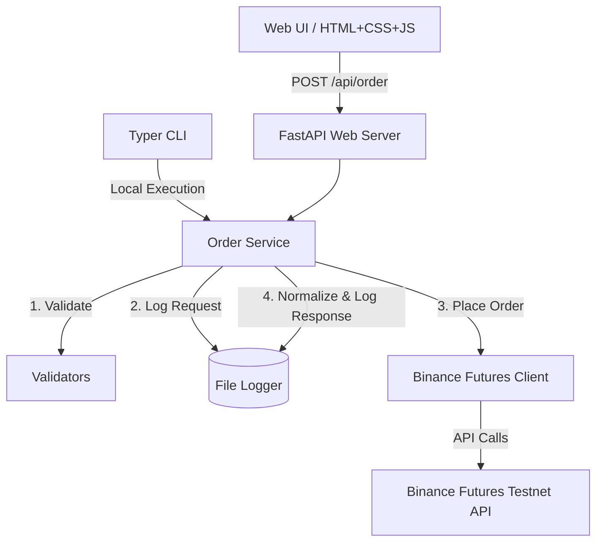
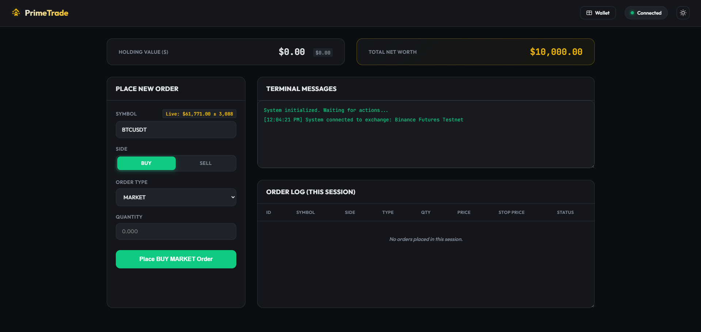
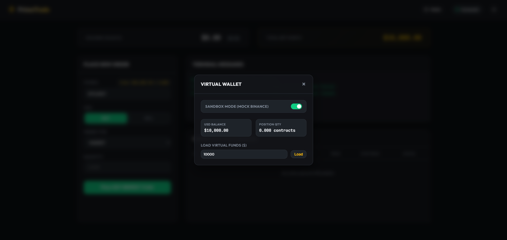

# Prime Trade Assignment: Binance Futures Trading Terminal

A robust, production-ready trading terminal integration for the **Binance Futures Testnet** consisting of a FastAPI web application and a Typer-powered Command Line Interface (CLI). This application enables traders to validate, log, and execute Futures orders (`MARKET`, `LIMIT`, and `STOP_LIMIT`) with a high emphasis on visual excellence and solid architecture.

---

## 🏗️ Architecture Overview

The system uses a modular, decoupled architecture where both the CLI and Web interfaces rely on a centralized API layer:



### Main Components
1. **`api/binance_client.py`**: A clean wrappers around the `python-binance` library routing requests to the Binance Futures Testnet.
2. **`api/order_service.py`**: The core business logic layer that coordinates order validation, request logging, Binance interaction, response normalization, and response logging.
3. **`api/validators.py`**: Centralized input validation rules.
4. **`api/models.py`**: Pydantic schemas enforcing data types and validation shapes.
5. **`cli.py`**: A Typer-powered command-line interface featuring beautiful, colored tables and panels powered by `rich`.
6. **`web/main.py`**: A FastAPI-based web application with AJAX communication endpoints.
7. **`web/static/` & `web/templates/`**: Frontend assets styled with modern, dark-themed aesthetics, glassmorphism, Outfit typography, and dynamic animations.

---

## ⚙️ Setup and Installation

### 1. Prerequisites
- Python 3.10+ installed.

### 2. Installation Steps
Clone or extract the repository, navigate to the folder, and run:

```bash
# Create and activate virtual environment
python -m venv .venv
.venv\Scripts\activate      # On Windows
source .venv/bin/activate    # On Linux/macOS

# Install dependencies
pip install -r requirements.txt
```

### 3. Environment Configuration
Create a `.env` file in the root directory (you can copy `.env.example` as a starting template):

```bash
copy .env.example .env
```

Open `.env` and fill in your Binance Futures Testnet API credentials:

```ini
BINANCE_API_KEY=your_futures_testnet_api_key_here
BINANCE_API_SECRET=your_futures_testnet_api_secret_here
BINANCE_TESTNET=True
```

> [!NOTE]
> You can acquire your API keys by logging into the [Binance Futures Testnet Console](https://testnet.binancefuture.com).

---

## 🚀 Running the Terminal

### Web Interface
To run the local web server:

```bash
uvicorn web.main:app --host 127.0.0.1 --port 8000 --reload
```

Then, open your browser and navigate to: `http://127.0.0.1:8000`.

#### Features of the Web UI:
- **Theme Persistence**: Light and dark visual mode toggles that automatically save your preference via `localStorage`.
- **Side Selection Colors**: Selecting **BUY** changes the button themes and order badges to green; selecting **SELL** switches the theme to red.
- **Dynamic Forms**: Input fields dynamically appear/disappear according to the selected **Order Type** (e.g., hiding price fields for `MARKET` orders, showing target/trigger price fields for `STOP_LIMIT` orders).
- **Live Terminal Log**: A scrollable mock-terminal box that outputs real-time log details for actions performed during the web session.
- **Interactive Log Table**: An auto-updating order history log table tracking all executions made during the browser session.

### CLI (Command Line Interface)
The CLI supports the following commands:

#### 1. System Health Check
Check connectivity to the Binance Futures Testnet server:
```bash
python cli.py health
```

#### 2. Place a MARKET Order
```bash
python cli.py market --symbol BTCUSDT --side BUY --quantity 0.005
```

#### 3. Place a LIMIT Order
```bash
python cli.py limit --symbol BTCUSDT --side SELL --quantity 0.01 --price 68500
```

#### 4. Place a STOP_LIMIT Order
```bash
python cli.py stop-limit --symbol BTCUSDT --side BUY --quantity 0.02 --price 69200 --stop-price 69000
```

---

## 📸 Interface Screenshots

Here is the current updated view of the PrimeTrade Web UI Terminal:



Here is the view of the new Virtual Wallet modal interface:



---

## 📝 Logging Strategy

All orders placed through either the CLI or Web UI go through the centralized logger. Logs are saved in the `logs/` directory.

### Example Logs

#### Market Order: `logs/market_order_example.log`
```text
2026-06-03 13:45:12,104 | INFO | ORDER REQUEST: type=OrderType.MARKET, symbol=BTCUSDT, side=OrderSide.BUY, quantity=0.005, price=None, stop_price=None
2026-06-03 13:45:12,658 | INFO | ORDER RESPONSE SUCCESS: symbol=BTCUSDT, orderId=284719382, status=FILLED, executedQty=0.005, avgPrice=68420.50
```

#### Limit Order: `logs/limit_order_example.log`
```text
2026-06-03 13:48:02,410 | INFO | ORDER REQUEST: type=OrderType.LIMIT, symbol=BTCUSDT, side=OrderSide.SELL, quantity=0.012, price=69150.00, stop_price=None
2026-06-03 13:48:02,912 | INFO | ORDER RESPONSE SUCCESS: symbol=BTCUSDT, orderId=284720104, status=NEW, executedQty=0.000, avgPrice=0.00
```

---

## 🛠️ Assumptions and Design Decisions
1. **Quantity Safety**: All orders must specify a quantity greater than zero.
2. **Precision Management**: Quantities and prices are processed through `Decimal` in the Pydantic models to prevent standard float precision errors, and coerced to `float` right before passing to the `python-binance` library which requires native Python floats.
3. **Binance Futures Rules**: All orders are placed as Futures orders on the Testnet exchange (leveraging standard `futures_create_order` API endpoints). Time In Force is default-pinned to `GTC` (Good 'Til Cancelled) for LIMIT and STOP_LIMIT orders.
